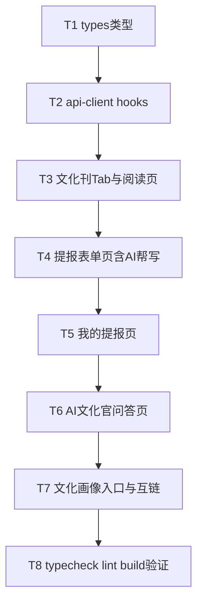

# 文化刊 Plan 4 · H5 前端 实现计划

> **面向 Agent 执行：** 必须使用 superpowers:subagent-driven-development（推荐）或 superpowers:executing-plans 逐任务执行。步骤用 `- [ ]` 勾选跟踪。

**目标：** H5 新增「文化刊」Tab——阅读当期刊（9 类栏目）、提报星标（含 AI 帮写）、我的提报、AI 文化官问答、我的文化画像（复用现有 DNA）。

**架构概述：** monorepo `culture_points_mall_web`。新增 `packages/types` 类型 + `packages/api-client` hooks + `apps/h5` 页面；底部加 1 个 Tab，提报/我的提报/AI 全部收在文化刊内（不另开 Tab）。复用 `@cpm/ui` 组件与既有 react-query + axios 范式。

**技术栈：** React 19 + Vite + TS + unoCSS + react-query + zustand + framer-motion；包管理 pnpm + turbo；lint biome、typecheck tsc。

**前置：** 后端 Plan 1-3 已就绪（接口见下）。范式见 Explore 报告：hook 模板 `packages/api-client/src/hooks/useMall.ts`、类型 `packages/types/src/activity.ts`、H5 列表页 `apps/h5/src/pages/mall/MallPage.tsx`、AI 页 `apps/h5/src/pages/dna/DNAReportPage.tsx`、Tab 配置 `apps/h5/src/layout/AppShell.tsx`、UI 组件 `@cpm/ui`。token 自动带 `cpm_jwt`。

**对接的后端接口**（员工端，JWT）：
- `GET /api/v1/publications` `/current` `/:id`（current/detail 返回 `{publication, sections:[{section, snapshot, articles}]}`）
- `GET /api/v1/stars/seasons/current` → `{season, nominateRemaining}`
- `POST /api/v1/stars/nominations` body `{seasonId, nomineeId?, dimensionId, caseText}`
- `GET /api/v1/stars/nominations/mine?seasonId=` → `{submitted, received}`
- `POST /api/v1/stars/nominations/ai-draft` body `{dimensionName, hint}` → `{draft}`（503=AI 未配置）
- `POST /api/v1/culture-qa/ask` body `{question}` → `{answer}`（503=AI 未配置）
- `GET /api/v1/me/dna-report?period=quarter`（AI③ 复用，已有 DNAReportPage）
- `GET /api/v1/values/dimensions` → `{items}`（提报选价值观用，已有 useDimensions）

## 实现流程



---

### Task 1: types 类型

**Files:**
- Create: `packages/types/src/publication.ts`
- Create: `packages/types/src/star.ts`
- Modify: `packages/types/src/index.ts`

- [ ] **Step 1: publication.ts**

```typescript
export type PublicationStatus = 'draft' | 'published' | 'archived';
export type SectionType =
  | 'editorial' | 'star' | 'values' | 'honors'
  | 'lottery' | 'activity' | 'leaderboard' | 'innovation' | 'custom';

export interface Publication {
  id: number;
  seasonId?: number;
  title: string;
  periodCode: string;
  coverImageUrl?: string;
  introText?: string;
  status: PublicationStatus;
  publishedAt?: string;
  createdAt: string;
}

export interface PublicationSection {
  id: number;
  publicationId: number;
  type: SectionType;
  title: string;
  sortOrder: number;
  visible: boolean;
  aiCopy?: string;
}

export interface PublicationArticle {
  id: number;
  title: string;
  summary?: string;
  contentHtml: string;
  coverImageUrl?: string;
  valueDimensionId?: number;
  status: string;
}

// 快照行（与后端 domain/aggregate.go 的 json tag 对齐）
export interface StarWinnerRow { userId: number; name: string; avatarUrl: string; dimension: string; citation: string; }
export interface ValueRow { dimensionId: number; name: string; description: string; icon: string; color: string; nominationCount: number; }
export interface HonorRow { userId: number; name: string; badge: string; rarity: string; iconUrl: string; earnedAt: string; }
export interface LotteryRow { userId: number; name: string; prize: string; wonAt: string; }
export interface ActivityRow { id: number; title: string; startAt: string; }
export interface LeaderRow { userId: number; name: string; score: number; }

export interface SectionView {
  section: PublicationSection;
  snapshot?: unknown; // 按 section.type 断言为对应 Row[]
  articles?: PublicationArticle[];
}

export interface PublishedView {
  publication: Publication;
  sections: SectionView[];
}
```

- [ ] **Step 2: star.ts**

```typescript
export type SeasonStatus = 'nominating' | 'judging' | 'published' | 'closed';

export interface StarSeason {
  id: number;
  name: string;
  quarterCode: string;
  status: SeasonStatus;
}

export interface SeasonQuota {
  season: StarSeason | null;
  nominateRemaining: number;
}

export type NominationStatus = 'submitted' | 'duplicate' | 'shortlisted' | 'selected' | 'rejected';

export interface Nomination {
  ID: number;
  SeasonID: number;
  NominatorID: number;
  NomineeID: number;
  DimensionID: number;
  CaseText: string;
  CaseRefined?: string | null;
  Status: NominationStatus;
  Score?: number | null;
  CreatedAt: string;
}

export interface MyNominations {
  submitted: Nomination[] | null;
  received: Nomination[] | null;
}
```

- [ ] **Step 3: index.ts 导出**

在 `packages/types/src/index.ts` 末尾加：
```typescript
export * from './publication';
export * from './star';
```

- [ ] **Step 4: typecheck + 提交**

Run: `cd /Users/standardsoftware/go/culture_points_mall_web && pnpm --filter @cpm/types typecheck` （若无该 script 则 `pnpm -w typecheck` 或 `pnpm exec tsc -p packages/types --noEmit`）
Expected: 通过。
```bash
git add packages/types/src/publication.ts packages/types/src/star.ts packages/types/src/index.ts
git commit -m "feat:文化刊前端类型定义"
```

---

### Task 2: api-client hooks

**Files:**
- Create: `packages/api-client/src/hooks/usePublications.ts`
- Create: `packages/api-client/src/hooks/useStars.ts`
- Create: `packages/api-client/src/hooks/useCultureQA.ts`
- Modify: `packages/api-client/src/index.ts`

- [ ] **Step 1: usePublications.ts**

```typescript
import { useQuery } from '@tanstack/react-query';
import type { Publication, PublishedView } from '@cpm/types';
import { http } from '../http';

export function usePublications() {
  return useQuery<{ items: Publication[] | null }>({
    queryKey: ['publications', 'list'],
    queryFn: async () => (await http().get('/api/v1/publications')).data,
    staleTime: 5 * 60_000,
  });
}

export function useCurrentPublication() {
  return useQuery<PublishedView | { publication: null }>({
    queryKey: ['publications', 'current'],
    queryFn: async () => (await http().get('/api/v1/publications/current')).data,
    staleTime: 5 * 60_000,
  });
}

export function usePublicationDetail(id: number) {
  return useQuery<PublishedView>({
    queryKey: ['publications', 'detail', id],
    queryFn: async () => (await http().get(`/api/v1/publications/${id}`)).data,
    enabled: id > 0,
  });
}
```

- [ ] **Step 2: useStars.ts**

```typescript
import { useQuery, useMutation, useQueryClient } from '@tanstack/react-query';
import type { SeasonQuota, MyNominations, Nomination } from '@cpm/types';
import { http } from '../http';

export function useCurrentSeason() {
  return useQuery<SeasonQuota>({
    queryKey: ['stars', 'season', 'current'],
    queryFn: async () => (await http().get('/api/v1/stars/seasons/current')).data,
    staleTime: 60_000,
  });
}

export function useMyNominations(seasonId?: number) {
  return useQuery<MyNominations>({
    queryKey: ['stars', 'nominations', 'mine', seasonId ?? 0],
    queryFn: async () =>
      (await http().get('/api/v1/stars/nominations/mine', { params: { seasonId: seasonId ?? 0 } })).data,
    enabled: (seasonId ?? 0) > 0,
  });
}

export interface NominateInput {
  seasonId: number;
  nomineeId?: number;
  dimensionId: number;
  caseText: string;
}

export function useNominate() {
  const qc = useQueryClient();
  return useMutation<Nomination, Error, NominateInput>({
    mutationFn: async (input) => (await http().post('/api/v1/stars/nominations', input)).data,
    onSuccess: () => {
      qc.invalidateQueries({ queryKey: ['stars', 'season', 'current'] });
      qc.invalidateQueries({ queryKey: ['stars', 'nominations', 'mine'] });
    },
  });
}

export function useAiDraftCase() {
  return useMutation<{ draft: string }, Error, { dimensionName: string; hint: string }>({
    mutationFn: async (input) =>
      (await http().post('/api/v1/stars/nominations/ai-draft', input)).data,
  });
}
```

- [ ] **Step 3: useCultureQA.ts**

```typescript
import { useMutation } from '@tanstack/react-query';
import { http } from '../http';

export function useCultureQA() {
  return useMutation<{ answer: string }, Error, string>({
    mutationFn: async (question) =>
      (await http().post('/api/v1/culture-qa/ask', { question })).data,
  });
}
```

- [ ] **Step 4: index.ts 导出 + 验证 + 提交**

`packages/api-client/src/index.ts` 末尾加：
```typescript
export * from './hooks/usePublications';
export * from './hooks/useStars';
export * from './hooks/useCultureQA';
```
Run: `cd /Users/standardsoftware/go/culture_points_mall_web && pnpm --filter @cpm/api-client typecheck`（或 `pnpm exec tsc -p packages/api-client --noEmit`）
```bash
git add packages/api-client/src/
git commit -m "feat:文化刊前端api hooks"
```

---

### Task 3: 文化刊 Tab + 阅读页

**Files:**
- Modify: `apps/h5/src/layout/AppShell.tsx`（TABS 加文化刊）
- Modify: `apps/h5/src/router.tsx`（加路由）
- Create: `apps/h5/src/pages/publications/PublicationsPage.tsx`
- Create: `apps/h5/src/pages/publications/SectionRenderer.tsx`

- [ ] **Step 1: AppShell 加 Tab**

`apps/h5/src/layout/AppShell.tsx` 的 `TABS` 数组在 mall 与 me 之间插入（参 Explore 报告片段）：
```tsx
{ key: 'publications', label: '文化刊', icon: <BookOpen size={22} />, path: '/publications' },
```
顶部 import 加 `BookOpen`：`import { Trophy, Target, Gift, User, BookOpen } from 'lucide-react';`（按现有 import 行补 BookOpen）。

- [ ] **Step 2: router 加路由**

`apps/h5/src/router.tsx` 在 AppShell 路由组内（mall 后、me 前）加：
```tsx
<Route path="/publications" element={<PublicationsPage />} />
<Route path="/publications/nominate" element={<NominatePage />} />
<Route path="/publications/mine" element={<MyNominationsPage />} />
<Route path="/publications/qa" element={<CultureQAPage />} />
```
顶部 import 这 4 个页面组件（NominatePage/MyNominationsPage/CultureQAPage 在后续 Task 创建——本 Task 先只创建 PublicationsPage，其余 import 在对应 Task 加，避免编译断；**故本步只加 `/publications` 一条路由 + import PublicationsPage**，其余路由在 Task 4/5/6 各自加）。

修正：本 Task 只加：
```tsx
<Route path="/publications" element={<PublicationsPage />} />
```
+ `import { PublicationsPage } from './pages/publications/PublicationsPage';`

- [ ] **Step 3: SectionRenderer.tsx（按 type 渲染快照/文章）**

```tsx
import type { SectionView, StarWinnerRow, HonorRow, LotteryRow, LeaderRow, ValueRow, ActivityRow } from '@cpm/types';
import { Avatar } from '@cpm/ui';

export function SectionRenderer({ view }: { view: SectionView }) {
  const { section, snapshot, articles } = view;
  return (
    <section style={{ marginBottom: 18 }}>
      <h3 style={{ fontSize: 15, fontWeight: 700, color: 'var(--cpm-text)', margin: '0 0 4px' }}>{section.title}</h3>
      {section.aiCopy && <p style={{ fontSize: 12, color: 'var(--cpm-text-dim)', margin: '0 0 10px' }}>{section.aiCopy}</p>}
      {snapshot != null && <SnapshotBody type={section.type} data={snapshot} />}
      {articles?.map((a) => (
        <article key={a.id} style={cardStyle}>
          <div style={{ fontWeight: 600, marginBottom: 4 }}>{a.title}</div>
          <div style={{ fontSize: 13, color: 'var(--cpm-text-dim)', whiteSpace: 'pre-wrap' }}>{a.contentHtml}</div>
        </article>
      ))}
    </section>
  );
}

const cardStyle: React.CSSProperties = {
  background: 'var(--cpm-surface)', borderRadius: 14, padding: 12, marginBottom: 8,
  border: '1px solid var(--cpm-border)',
};

function SnapshotBody({ type, data }: { type: string; data: unknown }) {
  switch (type) {
    case 'star': {
      const rows = data as StarWinnerRow[];
      return (
        <div style={{ display: 'flex', gap: 12, flexWrap: 'wrap' }}>
          {rows.map((r) => (
            <div key={`${r.userId}-${r.dimension}`} style={{ textAlign: 'center', width: 72 }}>
              <Avatar name={r.name} avatarUrl={r.avatarUrl} size={48} />
              <div style={{ fontSize: 11, marginTop: 4 }}>{r.name}</div>
              <div style={{ fontSize: 9, color: 'var(--cpm-text-dim)' }}>{r.dimension}</div>
            </div>
          ))}
        </div>
      );
    }
    case 'leaderboard': {
      const rows = data as LeaderRow[];
      return <ol style={listStyle}>{rows.map((r, i) => <li key={r.userId}>{i + 1}. {r.name} · {r.score}</li>)}</ol>;
    }
    case 'honors': {
      const rows = data as HonorRow[];
      return <ul style={listStyle}>{rows.map((r, i) => <li key={i}>🏅 {r.name} · {r.badge}</li>)}</ul>;
    }
    case 'lottery': {
      const rows = data as LotteryRow[];
      return <ul style={listStyle}>{rows.map((r, i) => <li key={i}>🎁 {r.name} · {r.prize}</li>)}</ul>;
    }
    case 'activity': {
      const rows = data as ActivityRow[];
      return <ul style={listStyle}>{rows.map((r) => <li key={r.id}>📸 {r.title} · {r.startAt}</li>)}</ul>;
    }
    case 'values': {
      const rows = data as ValueRow[];
      return (
        <div style={{ display: 'flex', flexWrap: 'wrap', gap: 6 }}>
          {rows.map((r) => (
            <span key={r.dimensionId} style={{ fontSize: 11, padding: '4px 10px', borderRadius: 16, background: r.color ? `${r.color}22` : 'var(--cpm-surface)', color: r.color || 'var(--cpm-text)' }}>
              {r.name}{r.nominationCount > 0 ? ` · ${r.nominationCount}` : ''}
            </span>
          ))}
        </div>
      );
    }
    default:
      return null;
  }
}

const listStyle: React.CSSProperties = { fontSize: 13, lineHeight: 1.9, color: 'var(--cpm-text)', paddingLeft: 0, listStyle: 'none', margin: 0 };
```

- [ ] **Step 4: PublicationsPage.tsx**

```tsx
import { useNavigate } from 'react-router-dom';
import { useCurrentPublication } from '@cpm/api-client';
import { PageHeader, EmptyState } from '@cpm/ui';
import type { PublishedView } from '@cpm/types';
import { SectionRenderer } from './SectionRenderer';
import { Sparkles, MessageCircle, PencilLine } from 'lucide-react';

export function PublicationsPage() {
  const nav = useNavigate();
  const q = useCurrentPublication();

  if (q.isLoading) return <div style={{ padding: 24 }}>加载中…</div>;
  const view = q.data as PublishedView | undefined;
  if (!view || !('publication' in view) || !view.publication) {
    return <EmptyState icon="📖" title="本期文化刊还没发布" />;
  }
  const { publication, sections } = view;

  return (
    <div style={{ padding: '12px 14px 80px' }}>
      <PageHeader title={publication.title} subtitle={publication.periodCode} />
      {publication.introText && (
        <p style={{ fontSize: 13, color: 'var(--cpm-text-dim)', lineHeight: 1.7, margin: '8px 0 16px' }}>{publication.introText}</p>
      )}

      {/* 提报 CTA + AI 双入口（提报评选入口收在文化刊内） */}
      <button onClick={() => nav('/publications/nominate')} style={ctaStyle}>
        <PencilLine size={18} /> 提报本季文化星标
      </button>
      <div style={{ display: 'flex', gap: 10, margin: '10px 0 18px' }}>
        <button onClick={() => nav('/dna')} style={pillStyle}><Sparkles size={16} /> 我的文化画像</button>
        <button onClick={() => nav('/publications/qa')} style={pillStyle}><MessageCircle size={16} /> AI 文化官</button>
      </div>

      {sections.map((s) => <SectionRenderer key={s.section.id} view={s} />)}

      <button onClick={() => nav('/publications/mine')} style={{ ...pillStyle, width: '100%', marginTop: 8 }}>我的提报 ›</button>
    </div>
  );
}

const ctaStyle: React.CSSProperties = {
  width: '100%', display: 'flex', alignItems: 'center', justifyContent: 'center', gap: 8,
  padding: 14, borderRadius: 14, border: 'none', color: '#fff', fontWeight: 700, fontSize: 14,
  background: 'linear-gradient(135deg,#a855f7,#4f7cff)',
};
const pillStyle: React.CSSProperties = {
  flex: 1, display: 'flex', alignItems: 'center', justifyContent: 'center', gap: 6,
  padding: 10, borderRadius: 12, border: '1px solid var(--cpm-border)', background: 'var(--cpm-surface)',
  color: 'var(--cpm-text)', fontSize: 12,
};
```

- [ ] **Step 5: 验证 + 提交**

Run: `cd /Users/standardsoftware/go/culture_points_mall_web && pnpm --filter @cpm/h5 typecheck && pnpm --filter @cpm/h5 lint`
Expected: 通过（其余页面路由 Task 4-6 加，现在 PublicationsPage 跳转的 /publications/nominate 等暂未注册但 nav 字符串不影响编译）。
```bash
git add apps/h5/src/layout/AppShell.tsx apps/h5/src/router.tsx apps/h5/src/pages/publications/
git commit -m "feat:H5文化刊Tab与阅读页"
```

---

### Task 4: 提报表单页（含 AI 帮写）

**Files:**
- Create: `apps/h5/src/pages/publications/NominatePage.tsx`
- Modify: `apps/h5/src/router.tsx`（加 `/publications/nominate` 路由 + import）

- [ ] **Step 1: NominatePage.tsx**

```tsx
import { useState } from 'react';
import { useNavigate } from 'react-router-dom';
import { useCurrentSeason, useNominate, useAiDraftCase, useDimensions } from '@cpm/api-client';
import { PageHeader } from '@cpm/ui';
import { Sparkles } from 'lucide-react';

export function NominatePage() {
  const nav = useNavigate();
  const seasonQ = useCurrentSeason();
  const dimsQ = useDimensions();
  const nominate = useNominate();
  const aiDraft = useAiDraftCase();

  const [dimId, setDimId] = useState<number>(0);
  const [nomineeId, setNomineeId] = useState<string>(''); // 空=自荐
  const [caseText, setCaseText] = useState('');
  const [err, setErr] = useState<string | null>(null);

  const season = seasonQ.data?.season;
  const dims = dimsQ.data?.items ?? [];
  const dimName = dims.find((d) => d.id === dimId)?.name ?? '';

  if (!season) return <div style={{ padding: 24 }}>当前没有开放提报的季次</div>;

  const onAiDraft = () => {
    if (!dimName) { setErr('请先选价值观'); return; }
    aiDraft.mutate({ dimensionName: dimName, hint: caseText || '请根据该价值观写一段示例' }, {
      onSuccess: (r) => setCaseText(r.draft),
      onError: (e: any) => setErr(e?.response?.status === 503 ? 'AI 暂未开启' : '生成失败'),
    });
  };

  const onSubmit = () => {
    if (!dimId || !caseText.trim()) { setErr('请选价值观并填写案例'); return; }
    nominate.mutate(
      { seasonId: season.id, dimensionId: dimId, caseText, nomineeId: nomineeId ? Number(nomineeId) : undefined },
      {
        onSuccess: () => nav('/publications/mine'),
        onError: (e: any) => setErr(e?.response?.data?.error ?? '提交失败'),
      },
    );
  };

  return (
    <div style={{ padding: '12px 14px 80px' }}>
      <PageHeader title="提报星标" subtitle={`${season.name} · 本月还可得 ${seasonQ.data?.nominateRemaining ?? 0} 分`} />

      <label style={lbl}>提报对象（留空=自荐）</label>
      <input value={nomineeId} onChange={(e) => setNomineeId(e.target.value)} placeholder="同事 ID，自荐留空" style={inp} />

      <label style={lbl}>践行的价值观</label>
      <div style={{ display: 'flex', flexWrap: 'wrap', gap: 6 }}>
        {dims.map((d) => (
          <button key={d.id} onClick={() => setDimId(d.id)} style={{ ...chip, ...(dimId === d.id ? chipActive : {}) }}>{d.name}</button>
        ))}
      </div>

      <div style={{ display: 'flex', justifyContent: 'space-between', alignItems: 'center', margin: '14px 0 5px' }}>
        <label style={lbl}>案例描述</label>
        <button onClick={onAiDraft} disabled={aiDraft.isPending} style={aiBtn}><Sparkles size={13} /> {aiDraft.isPending ? '生成中…' : 'AI 帮我写'}</button>
      </div>
      <textarea value={caseText} onChange={(e) => setCaseText(e.target.value)} rows={5} placeholder="说一两句他做了啥…" style={{ ...inp, minHeight: 96 }} />

      {err && <div style={{ color: '#ef4444', fontSize: 12, marginTop: 8 }}>{err}</div>}
      <button onClick={onSubmit} disabled={nominate.isPending} style={submitBtn}>{nominate.isPending ? '提交中…' : '提交提报'}</button>
    </div>
  );
}

const lbl: React.CSSProperties = { display: 'block', fontSize: 12, color: 'var(--cpm-text-dim)', margin: '14px 0 5px' };
const inp: React.CSSProperties = { width: '100%', padding: 10, borderRadius: 10, border: '1px solid var(--cpm-border)', background: 'var(--cpm-surface)', color: 'var(--cpm-text)', fontSize: 13 };
const chip: React.CSSProperties = { fontSize: 12, padding: '6px 12px', borderRadius: 16, border: '1px solid var(--cpm-border)', background: 'var(--cpm-surface)', color: 'var(--cpm-text)' };
const chipActive: React.CSSProperties = { background: 'var(--cpm-primary)', color: '#fff', borderColor: 'transparent' };
const aiBtn: React.CSSProperties = { display: 'flex', alignItems: 'center', gap: 4, fontSize: 11, padding: '4px 10px', borderRadius: 14, border: 'none', color: '#fff', background: 'linear-gradient(135deg,#a855f7,#4f7cff)' };
const submitBtn: React.CSSProperties = { width: '100%', marginTop: 16, padding: 13, borderRadius: 12, border: 'none', background: 'var(--cpm-primary)', color: '#fff', fontWeight: 700, fontSize: 14 };
```
> 注：`useDimensions` 已存在于 api-client（Explore 报告 index.ts 导出），返回 `{items:[{id,code,name,...}]}`。若字段名不符，按实际调整。

- [ ] **Step 2: router 注册**

`apps/h5/src/router.tsx` AppShell 组内加 `<Route path="/publications/nominate" element={<NominatePage />} />` + 顶部 `import { NominatePage } from './pages/publications/NominatePage';`。

- [ ] **Step 3: 验证 + 提交**

Run: `pnpm --filter @cpm/h5 typecheck && pnpm --filter @cpm/h5 lint`
```bash
git add apps/h5/src/pages/publications/NominatePage.tsx apps/h5/src/router.tsx
git commit -m "feat:H5星标提报表单含AI帮写"
```

---

### Task 5: 我的提报页

**Files:**
- Create: `apps/h5/src/pages/publications/MyNominationsPage.tsx`
- Modify: `apps/h5/src/router.tsx`

- [ ] **Step 1: MyNominationsPage.tsx**

```tsx
import { useCurrentSeason, useMyNominations } from '@cpm/api-client';
import { PageHeader, EmptyState } from '@cpm/ui';
import type { Nomination } from '@cpm/types';

export function MyNominationsPage() {
  const seasonQ = useCurrentSeason();
  const seasonId = seasonQ.data?.season?.id ?? 0;
  const q = useMyNominations(seasonId);

  if (seasonQ.isLoading || q.isLoading) return <div style={{ padding: 24 }}>加载中…</div>;
  const submitted = q.data?.submitted ?? [];
  const received = q.data?.received ?? [];

  return (
    <div style={{ padding: '12px 14px 80px' }}>
      <PageHeader title="我的提报" subtitle={seasonQ.data?.season?.name} />
      <h3 style={h3}>我提报的（{submitted.length}）</h3>
      {submitted.length === 0 ? <EmptyState icon="✍️" title="还没提报过" /> : submitted.map((n) => <Row key={n.ID} n={n} />)}
      <h3 style={h3}>我被提名的（{received.length}）</h3>
      {received.length === 0 ? <EmptyState icon="🌟" title="还没被提名" /> : received.map((n) => <Row key={n.ID} n={n} />)}
    </div>
  );
}

function Row({ n }: { n: Nomination }) {
  return (
    <div style={{ background: 'var(--cpm-surface)', border: '1px solid var(--cpm-border)', borderRadius: 12, padding: 12, marginBottom: 8 }}>
      <div style={{ fontSize: 13, whiteSpace: 'pre-wrap' }}>{n.CaseRefined || n.CaseText}</div>
      <div style={{ fontSize: 11, color: 'var(--cpm-text-dim)', marginTop: 6 }}>状态：{statusLabel(n.Status)}</div>
    </div>
  );
}

function statusLabel(s: string): string {
  return { submitted: '已提交', shortlisted: '入围', selected: '当选星标', rejected: '未入选', duplicate: '重复' }[s] ?? s;
}

const h3: React.CSSProperties = { fontSize: 14, fontWeight: 700, margin: '16px 0 8px', color: 'var(--cpm-text)' };
```

- [ ] **Step 2: router 注册**

加 `<Route path="/publications/mine" element={<MyNominationsPage />} />` + import。

- [ ] **Step 3: 验证 + 提交**

Run: `pnpm --filter @cpm/h5 typecheck && pnpm --filter @cpm/h5 lint`
```bash
git add apps/h5/src/pages/publications/MyNominationsPage.tsx apps/h5/src/router.tsx
git commit -m "feat:H5我的提报页"
```

---

### Task 6: AI 文化官问答页

**Files:**
- Create: `apps/h5/src/pages/publications/CultureQAPage.tsx`
- Modify: `apps/h5/src/router.tsx`

- [ ] **Step 1: CultureQAPage.tsx**

```tsx
import { useState } from 'react';
import { useCultureQA } from '@cpm/api-client';
import { PageHeader } from '@cpm/ui';
import { Send } from 'lucide-react';

export function CultureQAPage() {
  const ask = useCultureQA();
  const [q, setQ] = useState('');
  const [history, setHistory] = useState<{ q: string; a: string }[]>([]);
  const [err, setErr] = useState<string | null>(null);

  const onAsk = () => {
    const question = q.trim();
    if (!question) return;
    setErr(null);
    ask.mutate(question, {
      onSuccess: (r) => { setHistory((h) => [...h, { q: question, a: r.answer }]); setQ(''); },
      onError: (e: any) => setErr(e?.response?.status === 503 ? 'AI 暂未开启' : '请求失败'),
    });
  };

  return (
    <div style={{ padding: '12px 14px 90px' }}>
      <PageHeader title="AI 文化官" subtitle="问问企业文化与价值观" />
      {history.map((item, i) => (
        <div key={i} style={{ marginBottom: 14 }}>
          <div style={{ textAlign: 'right', marginBottom: 6 }}><span style={bubbleUser}>{item.q}</span></div>
          <div><span style={bubbleAI}>{item.a}</span></div>
        </div>
      ))}
      {ask.isPending && <div style={{ fontSize: 12, color: 'var(--cpm-text-dim)' }}>思考中…</div>}
      {err && <div style={{ color: '#ef4444', fontSize: 12 }}>{err}</div>}
      <div style={{ position: 'fixed', bottom: 0, left: 0, right: 0, padding: 12, background: 'var(--cpm-bg)', display: 'flex', gap: 8 }}>
        <input value={q} onChange={(e) => setQ(e.target.value)} onKeyDown={(e) => e.key === 'Enter' && onAsk()} placeholder="例如：敢于创新指什么？" style={{ flex: 1, padding: 10, borderRadius: 20, border: '1px solid var(--cpm-border)', background: 'var(--cpm-surface)', color: 'var(--cpm-text)' }} />
        <button onClick={onAsk} disabled={ask.isPending} style={{ width: 44, borderRadius: '50%', border: 'none', background: 'var(--cpm-primary)', color: '#fff' }}><Send size={18} /></button>
      </div>
    </div>
  );
}

const bubbleUser: React.CSSProperties = { display: 'inline-block', maxWidth: '80%', padding: '8px 12px', borderRadius: 14, background: 'var(--cpm-primary)', color: '#fff', fontSize: 13, textAlign: 'left' };
const bubbleAI: React.CSSProperties = { display: 'inline-block', maxWidth: '85%', padding: '10px 12px', borderRadius: 14, background: 'var(--cpm-surface)', border: '1px solid var(--cpm-border)', color: 'var(--cpm-text)', fontSize: 13, whiteSpace: 'pre-wrap' };
```

- [ ] **Step 2: router 注册**

加 `<Route path="/publications/qa" element={<CultureQAPage />} />` + import。

- [ ] **Step 3: 验证 + 提交**

Run: `pnpm --filter @cpm/h5 typecheck && pnpm --filter @cpm/h5 lint`
```bash
git add apps/h5/src/pages/publications/CultureQAPage.tsx apps/h5/src/router.tsx
git commit -m "feat:H5 AI文化官问答页"
```

---

### Task 7: 文化画像入口与互链确认

**Files:**
- Verify only（画像复用现有 `/dna` 全屏页，PublicationsPage Task 3 已加「我的文化画像」按钮跳 `/dna`）

- [ ] **Step 1: 确认 /dna 路由存在且可达**

确认 `apps/h5/src/router.tsx` 有 `<Route path="/dna" element={<DNAReportPage />} />`（Explore 报告已存在）。PublicationsPage 的「我的文化画像」按钮 `nav('/dna')` 即复用 AI③。
> 若产品希望画像入口也在「我的」页，可在 `apps/h5/src/pages/me/` 加一个跳 `/dna` 的入口（可选，非必须）。

- [ ] **Step 2: 无代码改动则跳过提交**

---

### Task 8: typecheck + lint + build 验证

- [ ] **Step 1: 全量 typecheck + lint**

Run: `cd /Users/standardsoftware/go/culture_points_mall_web && pnpm -w typecheck && pnpm -w lint`（或 `pnpm turbo run typecheck lint`）
Expected: 全绿。

- [ ] **Step 2: H5 build**

Run: `pnpm --filter @cpm/h5 build`
Expected: tsc + vite build 通过。

- [ ] **Step 3: 冒烟（手动，需后端 :18080 + 前端 dev）**

`pnpm --filter @cpm/h5 dev`（:5173），浏览器 dev 模式（占位登录）：底部「文化刊」Tab → 阅读页渲染当期刊（无刊则空态）→ 提报页选价值观/AI帮我写/提交 → 我的提报 → AI 文化官问答。

- [ ] **Step 4: 最终提交**

```bash
git add -A && git commit -m "test:H5文化刊前端typecheck与lint通过" || echo "nothing to commit"
```

---

## 自检（spec 覆盖 / 占位符 / 类型一致）

- **spec 覆盖**：H5 文化刊 Tab（1 个）、阅读页（9 栏目按 type 渲染快照/文章）、提报（含 AI⑤帮写）、我的提报、AI④文化官问答、AI③画像（复用 /dna 入口）。admin 评选台/编排页 = Plan 5。
- **占位符**：页面样式用内联 style + CSS 变量（与 MallPage 范式一致）；若 `useDimensions` 返回字段与假设不符，按实际微调（已注明）。
- **类型一致**：`@cpm/types` 的 Publication/PublishedView/SectionView/各 Row/SeasonQuota/Nomination 与后端 json tag 对齐；hooks 返回类型与页面消费一致；路由 4 个子页面分别在 Task 3-6 注册，避免一次性 import 未创建组件导致编译断。

## 偏离与备注

- **提报对象用「同事 ID」输入框**（v1 简化）：后端 `nomineeId` 是用户 ID。理想是搜索同事选择器，但需要一个"列同事"接口（当前无公开的员工搜索端点）——v1 先用 ID 输入 / 自荐留空，搜索选择器留作后续（可复用 admin 的 UserDeptTree 思路或新增 `/api/v1/users/search`）。
- **富文本**：文章 `contentHtml` 本期用 `whiteSpace: pre-wrap` 纯文本渲染（AI 生成的是纯文本/轻 markdown）；若后续要真 HTML 渲染需引入 sanitizer，不在本期。
- **AI 503 处理**：ai-draft / culture-qa 在后端 LLM 未配置时返 503，前端显示「AI 暂未开启」而非报错。
