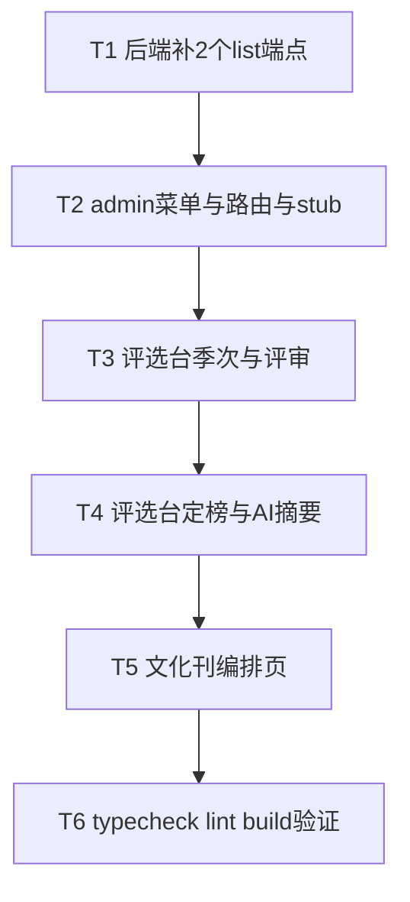

# 文化刊 Plan 5 · admin 前端（+2 个后端 list 端点）实现计划

> **面向 Agent 执行：** 必须使用 superpowers:subagent-driven-development（推荐）或 superpowers:executing-plans 逐任务执行。步骤用 `- [ ]` 勾选跟踪。

**目标：** admin 后台能操作完整文化刊周期——文化星标评选台（季次/评委打分+AI⑥/定榜）+ 文化刊编排页（建期/配栏目/聚合/AI 编排/写文章/发布/推钉钉）。

**架构概述：** 先在**后端仓库**补 2 个 admin list 端点（列季次、列含草稿刊物），再在**前端仓库** `apps/admin` 加 2 个页面 + Sidebar 菜单 + 路由。admin 沿用 axios 直调（`cpm_admin_jwt`）范式，参 `ValuesPage`/`ActivitiesPage`。

**⚠️ 跨两个仓库：**
- 后端：`/Users/standardsoftware/go/culture_points_mall`（分支 feat/culture-publication）— **仅 Task 1**。
- 前端：`/Users/standardsoftware/go/culture_points_mall_web`（分支 feat/culture-publication）— Task 2-6。

**技术栈：** Go/Gin（Task1）；React 19 + Vite + TS + framer-motion + axios（Task2-6）。

**对接的 admin 接口**（cpm_admin_jwt）：
- stars：`GET /admin/stars/seasons`(新,Task1) · `POST /admin/stars/seasons` · `PUT /admin/stars/seasons/:id/status` · `GET /admin/stars/seasons/:id/nominations` · `POST /admin/stars/nominations/:id/score` · `POST /admin/stars/seasons/:id/select` · `POST /admin/stars/seasons/:id/ai-digest`
- publication：`GET /admin/publications`(新,Task1) · `GET /admin/publications/:id` · `POST /admin/publications` · `PUT /admin/publications/:id/sections` · `POST /admin/publications/:id/aggregate` · `POST /admin/publications/:id/ai-compose` · `POST /admin/publications/:id/ai-cases` · `POST /admin/publications/:id/articles` · `POST /admin/publications/:id/publish` · `POST /admin/publications/:id/push-dingtalk`
- 辅助：`GET /api/v1/values/dimensions` · `GET /admin/dingtalk/robots`

## 实现流程



---

### Task 1: 后端补 2 个 admin list 端点（后端仓库）

**仓库：** `/Users/standardsoftware/go/culture_points_mall`

**Files:**
- Modify: `internal/modules/stars/service/service.go`、`internal/modules/stars/handler/handler.go`
- Modify: `internal/modules/publication/domain/repository.go`、`repository/gorm_repo.go`、`service/service.go`、`handler/handler.go`

- [ ] **Step 1: stars 列季次**

`stars/service/service.go` 加：
```go
func (s *Service) ListSeasons(ctx context.Context, tenantID int64) ([]domain.Season, error) {
	return s.Repo.ListSeasons(ctx, tenantID)
}
```
（`Repo.ListSeasons` 已在接口与 GormRepo 实现。）
`stars/handler/handler.go` 的 `RegisterAdmin` 加 `rg.GET("/admin/stars/seasons", h.listSeasons)` + 实现：
```go
func (h *Handler) listSeasons(c *gin.Context) {
	tid := cpmctx.TenantID(c.Request.Context())
	rows, err := h.Svc.ListSeasons(c.Request.Context(), tid)
	if err != nil {
		c.JSON(http.StatusInternalServerError, gin.H{"error": err.Error()})
		return
	}
	c.JSON(http.StatusOK, gin.H{"items": rows})
}
```

- [ ] **Step 2: publication 列含草稿**

`publication/domain/repository.go` 接口加 `ListAllForAdmin(ctx context.Context, tenantID int64) ([]Publication, error)`。
`publication/repository/gorm_repo.go` 加：
```go
func (r *GormRepo) ListAllForAdmin(ctx context.Context, tenantID int64) ([]domain.Publication, error) {
	var rows []domain.Publication
	err := r.DB.WithContext(ctx).Where("tenant_id = ?", tenantID).Order("id DESC").Find(&rows).Error
	return rows, err
}
```
`publication/service/service.go` 加：
```go
func (s *Service) ListAllForAdmin(ctx context.Context, tenantID int64) ([]domain.Publication, error) {
	return s.Repo.ListAllForAdmin(ctx, tenantID)
}
```
`publication/handler/handler.go` 的 `RegisterAdmin` 加 `rg.GET("/admin/publications", h.adminList)` + 实现：
```go
func (h *Handler) adminList(c *gin.Context) {
	tid := cpmctx.TenantID(c.Request.Context())
	rows, err := h.Svc.ListAllForAdmin(c.Request.Context(), tid)
	if err != nil {
		c.JSON(http.StatusInternalServerError, gin.H{"error": err.Error()})
		return
	}
	c.JSON(http.StatusOK, gin.H{"items": rows})
}
```

- [ ] **Step 3: 验证 + 提交（后端仓库）**

Run: `cd /Users/standardsoftware/go/culture_points_mall && go build ./... && go vet ./... && go test ./...`
Expected: 全绿（`*GormRepo` 满足 publication 接口新增方法）。
```bash
git -C /Users/standardsoftware/go/culture_points_mall add internal/modules/stars/ internal/modules/publication/
git -C /Users/standardsoftware/go/culture_points_mall commit -m "feat:admin补列季次与列全部刊物端点"
```

---

### Task 2: admin 菜单 + 路由 + stub 页面（前端仓库）

**仓库：** `/Users/standardsoftware/go/culture_points_mall_web`

**Files:**
- Modify: `apps/admin/src/layout/Sidebar.tsx`、`apps/admin/src/router.tsx`
- Create: `apps/admin/src/pages/stars/StarsPage.tsx`（stub）、`apps/admin/src/pages/publications/PublicationsPage.tsx`（stub）
- Create: `apps/admin/src/api/cultureApi.ts`（admin axios 封装）

- [ ] **Step 1: admin axios 封装（统一带 cpm_admin_jwt）**

`apps/admin/src/api/cultureApi.ts`：
```typescript
import axios from 'axios';

function authHeaders() {
  const token = localStorage.getItem('cpm_admin_jwt');
  return { Authorization: `Bearer ${token}` };
}

export const cultureApi = {
  // stars
  listSeasons: () => axios.get('/admin/stars/seasons', { headers: authHeaders() }).then((r) => r.data.items ?? []),
  createSeason: (body: { name: string; quarterCode: string }) =>
    axios.post('/admin/stars/seasons', body, { headers: authHeaders() }).then((r) => r.data),
  advanceSeason: (id: number, status: string) =>
    axios.put(`/admin/stars/seasons/${id}/status`, { status }, { headers: authHeaders() }),
  listNominations: (seasonId: number) =>
    axios.get(`/admin/stars/seasons/${seasonId}/nominations`, { headers: authHeaders() }).then((r) => r.data.items ?? []),
  scoreNomination: (seasonId: number, nominationId: number, score: number) =>
    axios.post(`/admin/stars/nominations/${nominationId}/score`, { seasonId, score }, { headers: authHeaders() }),
  selectWinners: (seasonId: number, picks: Array<{ userId: number; dimensionId: number; sourceNominationId?: number; citation?: string }>) =>
    axios.post(`/admin/stars/seasons/${seasonId}/select`, { picks }, { headers: authHeaders() }),
  aiDigest: (seasonId: number) =>
    axios.post(`/admin/stars/seasons/${seasonId}/ai-digest`, {}, { headers: authHeaders() }).then((r) => r.data),
  // publications
  listPublications: () => axios.get('/admin/publications', { headers: authHeaders() }).then((r) => r.data.items ?? []),
  getPublication: (id: number) => axios.get(`/admin/publications/${id}`, { headers: authHeaders() }).then((r) => r.data),
  createPublication: (body: { title: string; periodCode: string; seasonId?: number }) =>
    axios.post('/admin/publications', body, { headers: authHeaders() }).then((r) => r.data),
  configureSections: (id: number, sections: Array<{ type: string; title: string; sortOrder: number; visible: boolean }>) =>
    axios.put(`/admin/publications/${id}/sections`, { sections }, { headers: authHeaders() }),
  aggregate: (id: number) => axios.post(`/admin/publications/${id}/aggregate`, {}, { headers: authHeaders() }),
  aiCompose: (id: number) => axios.post(`/admin/publications/${id}/ai-compose`, {}, { headers: authHeaders() }),
  aiCases: (id: number) => axios.post(`/admin/publications/${id}/ai-cases`, {}, { headers: authHeaders() }).then((r) => r.data),
  upsertArticle: (id: number, body: Record<string, unknown>) =>
    axios.post(`/admin/publications/${id}/articles`, body, { headers: authHeaders() }).then((r) => r.data),
  publish: (id: number) => axios.post(`/admin/publications/${id}/publish`, {}, { headers: authHeaders() }),
  pushDingtalk: (id: number, groupId: string) =>
    axios.post(`/admin/publications/${id}/push-dingtalk`, { groupId }, { headers: authHeaders() }),
  // 辅助
  dimensions: () => axios.get('/api/v1/values/dimensions', { headers: authHeaders() }).then((r) => r.data.items ?? []),
  robots: () => axios.get('/admin/dingtalk/robots', { headers: authHeaders() }).then((r) => r.data.items ?? r.data ?? []),
};
```
> 错误处理：调用方用 try/catch；503（AI 未配置）提示「AI 暂未开启」。

- [ ] **Step 2: stub 页面（先占位，Task3-5 填实）**

`apps/admin/src/pages/stars/StarsPage.tsx`:
```tsx
import { PageHeader } from '@cpm/ui';
export function StarsPage() {
  return <div><PageHeader title="文化星标" subtitle="评选台" /></div>;
}
```
`apps/admin/src/pages/publications/PublicationsPage.tsx`:
```tsx
import { PageHeader } from '@cpm/ui';
export function PublicationsPage() {
  return <div><PageHeader title="文化刊" subtitle="编排发布" /></div>;
}
```

- [ ] **Step 3: Sidebar + router**

`apps/admin/src/layout/Sidebar.tsx` 的 items 数组加（参 Explore 报告，在 mall 后）：
```tsx
{ to: '/stars', label: '文化星标', icon: '⭐', end: false },
{ to: '/publications', label: '文化刊', icon: '📰', end: false },
```
`apps/admin/src/router.tsx` 加（用现有 `wrap()`）：
```tsx
<Route path="/stars" element={wrap(<StarsPage />)} />
<Route path="/publications" element={wrap(<PublicationsPage />)} />
```
+ 顶部 import 两个页面。

- [ ] **Step 4: 验证 + 提交（前端仓库）**

Run: `cd /Users/standardsoftware/go/culture_points_mall_web && pnpm --filter @cpm/admin typecheck && pnpm exec biome check apps/admin/src/pages/stars apps/admin/src/pages/publications apps/admin/src/api`
```bash
git -C /Users/standardsoftware/go/culture_points_mall_web add apps/admin/src/
git -C /Users/standardsoftware/go/culture_points_mall_web commit -m "feat:admin文化星标与文化刊菜单路由与api封装"
```

---

### Task 3: 评选台 — 季次管理 + 评委评审

**仓库：** 前端

**Files:**
- Modify: `apps/admin/src/pages/stars/StarsPage.tsx`

- [ ] **Step 1: 季次列表 + 建季次 + 状态推进 + 评审打分**

StarsPage 实现（参 `ValuesPage`/`ActivitiesPage` 的 axios+useEffect+motion 范式）：
- 顶部 `PageHeader title="文化星标" subtitle="季度评选"`。
- 加载：`cultureApi.listSeasons()` → 季次卡片列表（name/quarterCode/status badge）。
- 「+ 新建季次」表单（name + quarterCode）→ `createSeason` → 刷新。
- 每个季次卡操作：状态按钮（nominating→judging→published，调 `advanceSeason(id, next)`）。
- 选中一个季次 → 下方「评审台」：`listNominations(seasonId)` → 提名列表（被提名人/维度/案例 case_refined||case_text/当前 score），每条一个分数输入 + 「打分」`scoreNomination`。
- 季次须 judging 才可打分（后端会校验，前端按 status 禁用打分按钮）。

完整代码骨架（关键逻辑，样式照 ValuesPage 用内联 + CSS 变量）：
```tsx
import { useEffect, useState } from 'react';
import { PageHeader, EmptyState, Button } from '@cpm/ui';
import { cultureApi } from '../../api/cultureApi';

interface Season { id: number; name: string; quarterCode: string; status: string; }
interface Nomination { ID: number; NomineeID: number; DimensionID: number; CaseText: string; CaseRefined?: string | null; Score?: number | null; Status: string; }

export function StarsPage() {
  const [seasons, setSeasons] = useState<Season[]>([]);
  const [sel, setSel] = useState<Season | null>(null);
  const [noms, setNoms] = useState<Nomination[]>([]);
  const [name, setName] = useState(''); const [qc, setQc] = useState('');
  const [msg, setMsg] = useState<string | null>(null);

  const reload = () => cultureApi.listSeasons().then(setSeasons).catch(() => {});
  useEffect(() => { reload(); }, []);
  useEffect(() => { if (sel) cultureApi.listNominations(sel.id).then(setNoms).catch(() => setNoms([])); }, [sel]);

  const create = async () => {
    if (!name || !qc) return;
    await cultureApi.createSeason({ name, quarterCode: qc }); setName(''); setQc(''); reload();
  };
  const advance = async (s: Season, next: string) => { await cultureApi.advanceSeason(s.id, next); reload(); setSel({ ...s, status: next }); };
  const score = async (n: Nomination, v: number) => {
    if (!sel) return;
    try { await cultureApi.scoreNomination(sel.id, n.ID, v); cultureApi.listNominations(sel.id).then(setNoms); }
    catch { setMsg('打分失败（季次需处于评审阶段）'); }
  };

  return (
    <div>
      <PageHeader title="文化星标" subtitle="季度评选" />
      {/* 建季次 */}
      <div style={{ display: 'flex', gap: 8, margin: '12px 0' }}>
        <input placeholder="季次名 如 2026 Q1" value={name} onChange={(e) => setName(e.target.value)} style={inp} />
        <input placeholder="quarterCode 如 2026Q1" value={qc} onChange={(e) => setQc(e.target.value)} style={inp} />
        <Button tone="primary" onClick={create}>新建季次</Button>
      </div>
      {/* 季次列表 */}
      {seasons.length === 0 && <EmptyState icon="⭐" title="还没有季次" />}
      {seasons.map((s) => (
        <div key={s.id} style={card} onClick={() => setSel(s)}>
          <b>{s.name}</b> <span style={badge}>{statusLabel(s.status)}</span>
          <div style={{ marginTop: 6, display: 'flex', gap: 6 }}>
            {nextStatus(s.status) && <Button onClick={(e) => { e.stopPropagation(); advance(s, nextStatus(s.status)!); }}>{`→ ${statusLabel(nextStatus(s.status)!)}`}</Button>}
          </div>
        </div>
      ))}
      {/* 评审台 */}
      {sel && (
        <div style={{ marginTop: 18 }}>
          <h3>评审台 · {sel.name}（{statusLabel(sel.status)}）</h3>
          {noms.length === 0 && <EmptyState icon="📝" title="本季暂无提报" />}
          {noms.map((n) => (
            <NominationRow key={n.ID} n={n} disabled={sel.status !== 'judging'} onScore={score} />
          ))}
        </div>
      )}
      {msg && <div style={{ color: '#ef4444', marginTop: 8 }}>{msg}</div>}
    </div>
  );
}

function NominationRow({ n, disabled, onScore }: { n: Nomination; disabled: boolean; onScore: (n: Nomination, v: number) => void }) {
  const [v, setV] = useState<string>(n.Score != null ? String(n.Score) : '');
  return (
    <div style={card}>
      <div style={{ fontSize: 13 }}>{n.CaseRefined || n.CaseText}</div>
      <div style={{ fontSize: 11, color: 'var(--cpm-ink-2,#888)', marginTop: 4 }}>被提名人#{n.NomineeID} · 维度#{n.DimensionID} · {statusLabel(n.Status)}</div>
      <div style={{ display: 'flex', gap: 6, marginTop: 6 }}>
        <input type="number" value={v} onChange={(e) => setV(e.target.value)} disabled={disabled} placeholder="分" style={{ ...inp, width: 80 }} />
        <Button onClick={() => onScore(n, Number(v))} disabled={disabled || v === ''}>打分</Button>
      </div>
    </div>
  );
}

function statusLabel(s: string): string {
  return { nominating: '提报中', judging: '评审中', published: '已公示', closed: '已结束', submitted: '已提交', selected: '当选', shortlisted: '入围', rejected: '未选', duplicate: '重复' }[s] ?? s;
}
function nextStatus(s: string): string | null {
  return { nominating: 'judging', judging: 'published', published: 'closed' }[s] ?? null;
}
const inp: React.CSSProperties = { padding: 8, borderRadius: 8, border: '1px solid var(--cpm-border-subtle,#ddd)', fontSize: 13 };
const card: React.CSSProperties = { background: 'var(--cpm-surface,#fff)', border: '1px solid var(--cpm-border-subtle,#eee)', borderRadius: 12, padding: 12, marginBottom: 10, cursor: 'pointer' };
const badge: React.CSSProperties = { fontSize: 11, padding: '2px 8px', borderRadius: 12, background: 'var(--cpm-surface-2,#f3f3f3)' };
```
> CSS 变量名以 ValuesPage 实际为准（带 fallback 值兜底）。`Button` 的 props 以 `@cpm/ui` 实际签名为准（tone 可能不同），实现时按真实签名调整。

- [ ] **Step 2: 验证 + 提交**

Run: `pnpm --filter @cpm/admin typecheck && pnpm exec biome check apps/admin/src/pages/stars`
```bash
git -C /Users/standardsoftware/go/culture_points_mall_web add apps/admin/src/pages/stars/
git -C /Users/standardsoftware/go/culture_points_mall_web commit -m "feat:admin评选台季次管理与评审打分"
```

---

### Task 4: 评选台 — 定榜 + AI⑥ 评审摘要

**仓库：** 前端

**Files:**
- Modify: `apps/admin/src/pages/stars/StarsPage.tsx`

- [ ] **Step 1: 加 AI 摘要 + 定榜**

在评审台区加：
- 「🧮 AI 评审摘要」按钮 → `cultureApi.aiDigest(sel.id)` → 渲染 `{summary, duplicates[]}`（503 提示「AI 暂未开启」）。
- 定榜：每条提名加「选为星标」勾选，收集 picks（userId=NomineeID, dimensionId=DimensionID, sourceNominationId=ID, citation 可选输入）→「确认定榜」`selectWinners(sel.id, picks)` → 成功提示 + 刷新提名（status 变 selected）。季次须 judging。

骨架：
```tsx
// StarsPage 内新增 state
const [digest, setDigest] = useState<{ summary: string; duplicates: string[] } | null>(null);
const [picks, setPicks] = useState<Record<number, boolean>>({});

const runDigest = async () => {
  if (!sel) return;
  try { setDigest(await cultureApi.aiDigest(sel.id)); }
  catch (e: any) { setMsg(e?.response?.status === 503 ? 'AI 暂未开启' : '生成失败'); }
};
const confirmSelect = async () => {
  if (!sel) return;
  const chosen = noms.filter((n) => picks[n.ID]).map((n) => ({ userId: n.NomineeID, dimensionId: n.DimensionID, sourceNominationId: n.ID }));
  if (chosen.length === 0) { setMsg('请先勾选当选提名'); return; }
  await cultureApi.selectWinners(sel.id, chosen);
  setMsg(`已定榜 ${chosen.length} 位`); cultureApi.listNominations(sel.id).then(setNoms);
};
```
评审台 UI 加：摘要按钮 + 摘要展示块 + 每条 NominationRow 加 checkbox（绑 picks）+ 底部「确认定榜」按钮。

- [ ] **Step 2: 验证 + 提交**

Run: `pnpm --filter @cpm/admin typecheck && pnpm exec biome check apps/admin/src/pages/stars`
```bash
git -C /Users/standardsoftware/go/culture_points_mall_web add apps/admin/src/pages/stars/
git -C /Users/standardsoftware/go/culture_points_mall_web commit -m "feat:admin评选台AI摘要与定榜"
```

---

### Task 5: 文化刊编排页

**仓库：** 前端

**Files:**
- Modify: `apps/admin/src/pages/publications/PublicationsPage.tsx`

- [ ] **Step 1: 列表 + 建期 + 编排流水**

PublicationsPage 实现（一页搞定，分两态：列表 / 编排某一期）：
- 列表：`listPublications()` → 刊物卡（title/periodCode/status）+「新建一期」(title+periodCode+可选 seasonId) `createPublication`。
- 选中一期 → 编排面板（draft 才可改）：
  1. **配栏目**：固定 9 类 checkbox + 排序（v1 可用固定顺序 + visible 勾选，sortOrder 用数组下标）→「保存栏目」`configureSections(id, sections)`。
  2. **聚合**：「聚合当期数据」`aggregate(id)`。
  3. **AI 编排**：「✍️ AI 一键编排」`aiCompose(id)`、「🔍 生成案例」`aiCases(id)`（503 提示）。
  4. **写文章**（可选）：标题+正文 `upsertArticle(id, {title, contentHtml, sectionId?})`。
  5. **预览**：`getPublication(id)` 展示 intro_text + sections。
  6. **发布**：`publish(id)`。
  7. **推钉钉**：选 robot（`robots()`）→ `pushDingtalk(id, groupId)`。

骨架（关键调用，UI 用按钮组 + 状态提示，样式照 ValuesPage）：
```tsx
import { useEffect, useState } from 'react';
import { PageHeader, EmptyState, Button } from '@cpm/ui';
import { cultureApi } from '../../api/cultureApi';

const SECTION_TYPES = [
  { type: 'editorial', title: '刊首语' }, { type: 'star', title: '星标公示' },
  { type: 'values', title: '价值观专区' }, { type: 'honors', title: '获奖公示' },
  { type: 'lottery', title: '中奖公示' }, { type: 'activity', title: '活动回顾' },
  { type: 'leaderboard', title: '文化分榜' }, { type: 'innovation', title: '创新项目' },
  { type: 'custom', title: '自定义' },
];

export function PublicationsPage() {
  const [list, setList] = useState<any[]>([]);
  const [cur, setCur] = useState<any | null>(null);
  const [robots, setRobots] = useState<any[]>([]);
  const [picked, setPicked] = useState<Record<string, boolean>>(() => Object.fromEntries(SECTION_TYPES.map((s) => [s.type, true])));
  const [msg, setMsg] = useState<string | null>(null);
  const [form, setForm] = useState({ title: '', periodCode: '' });

  const reload = () => cultureApi.listPublications().then(setList).catch(() => {});
  useEffect(() => { reload(); cultureApi.robots().then(setRobots).catch(() => {}); }, []);

  const create = async () => { if (!form.title || !form.periodCode) return; await cultureApi.createPublication(form); setForm({ title: '', periodCode: '' }); reload(); };
  const saveSections = async () => {
    if (!cur) return;
    const sections = SECTION_TYPES.filter((s) => picked[s.type]).map((s, i) => ({ type: s.type, title: s.title, sortOrder: i, visible: true }));
    await cultureApi.configureSections(cur.id, sections); setMsg('栏目已保存');
  };
  const act = async (fn: () => Promise<any>, ok: string) => { try { await fn(); setMsg(ok); reload(); } catch (e: any) { setMsg(e?.response?.status === 503 ? 'AI 暂未开启' : '操作失败'); } };

  if (cur) {
    return (
      <div>
        <PageHeader title={`编排 · ${cur.title}`} subtitle={cur.periodCode} action={<Button onClick={() => setCur(null)}>← 返回列表</Button>} />
        <section style={panel}>
          <h4>1 配栏目</h4>
          {SECTION_TYPES.map((s) => (
            <label key={s.type} style={{ marginRight: 12 }}>
              <input type="checkbox" checked={!!picked[s.type]} onChange={(e) => setPicked((p) => ({ ...p, [s.type]: e.target.checked }))} /> {s.title}
            </label>
          ))}
          <div><Button onClick={saveSections}>保存栏目</Button></div>
        </section>
        <section style={panel}>
          <h4>2 聚合 & AI</h4>
          <Button onClick={() => act(() => cultureApi.aggregate(cur.id), '已聚合快照')}>聚合当期数据</Button>{' '}
          <Button onClick={() => act(() => cultureApi.aiCompose(cur.id), 'AI 已生成刊首语/导语')}>✍️ AI 一键编排</Button>{' '}
          <Button onClick={() => act(() => cultureApi.aiCases(cur.id), 'AI 已生成案例')}>🔍 生成案例</Button>
        </section>
        <section style={panel}>
          <h4>3 发布 & 推送</h4>
          <Button tone="primary" onClick={() => act(() => cultureApi.publish(cur.id), '已发布')}>发布</Button>{' '}
          {robots.map((r: any) => <Button key={r.id} onClick={() => act(() => cultureApi.pushDingtalk(cur.id, r.id), '已推送')}>推「{r.name}」</Button>)}
        </section>
        {msg && <div style={{ color: 'var(--cpm-primary,#7c3aed)', marginTop: 8 }}>{msg}</div>}
      </div>
    );
  }

  return (
    <div>
      <PageHeader title="文化刊" subtitle="编排发布" />
      <div style={{ display: 'flex', gap: 8, margin: '12px 0' }}>
        <input placeholder="标题 如 2026 Q1 文化刊" value={form.title} onChange={(e) => setForm({ ...form, title: e.target.value })} style={inp} />
        <input placeholder="periodCode 如 2026Q1" value={form.periodCode} onChange={(e) => setForm({ ...form, periodCode: e.target.value })} style={inp} />
        <Button tone="primary" onClick={create}>新建一期</Button>
      </div>
      {list.length === 0 && <EmptyState icon="📰" title="还没有刊物" />}
      {list.map((p) => (
        <div key={p.id} style={cardP} onClick={() => setCur(p)}>
          <b>{p.title}</b> <span style={badge}>{p.status}</span> <span style={{ fontSize: 12, color: '#999' }}>{p.periodCode}</span>
        </div>
      ))}
      {msg && <div style={{ marginTop: 8 }}>{msg}</div>}
    </div>
  );
}

const inp: React.CSSProperties = { padding: 8, borderRadius: 8, border: '1px solid #ddd', fontSize: 13 };
const panel: React.CSSProperties = { background: 'var(--cpm-surface,#fff)', border: '1px solid #eee', borderRadius: 12, padding: 14, marginBottom: 12 };
const cardP: React.CSSProperties = { background: 'var(--cpm-surface,#fff)', border: '1px solid #eee', borderRadius: 12, padding: 12, marginBottom: 10, cursor: 'pointer' };
const badge: React.CSSProperties = { fontSize: 11, padding: '2px 8px', borderRadius: 12, background: '#f3f3f3' };
```
> 写文章(upsertArticle)与预览(getPublication)可作为编排面板的额外 section 补充（v1 可后补）；本 Task 至少完成 列表/建期/配栏目/聚合/AI/发布/推送 主链路。`Button` 的 tone 等 props 以 `@cpm/ui` 实际为准。

- [ ] **Step 2: 验证 + 提交**

Run: `pnpm --filter @cpm/admin typecheck && pnpm exec biome check apps/admin/src/pages/publications`
```bash
git -C /Users/standardsoftware/go/culture_points_mall_web add apps/admin/src/pages/publications/
git -C /Users/standardsoftware/go/culture_points_mall_web commit -m "feat:admin文化刊编排发布页"
```

---

### Task 6: typecheck + lint + build 验证

**仓库：** 前端

- [ ] **Step 1: admin typecheck + lint + build**

Run: `cd /Users/standardsoftware/go/culture_points_mall_web && pnpm --filter @cpm/admin typecheck && pnpm exec biome check apps/admin/src/pages/stars apps/admin/src/pages/publications apps/admin/src/api && pnpm --filter @cpm/admin build`
Expected: typecheck + 新文件 biome + vite build 全绿（既有文件的存量 lint 错误不在本期范围）。

- [ ] **Step 2: 冒烟（手动，需后端 :18080 + admin dev :5174 + 真/mock 钉钉）**

`pnpm --filter @cpm/admin dev`：文化星标页 建季次→推进 judging→打分→AI 摘要→勾选定榜；文化刊页 建期→配栏目→聚合→AI 编排→发布→推钉钉（mock 查 outbox）。

- [ ] **Step 3: 最终提交**

```bash
git -C /Users/standardsoftware/go/culture_points_mall_web add -A
git -C /Users/standardsoftware/go/culture_points_mall_web commit -m "test:admin文化刊前端验证通过" || echo "nothing to commit"
```

---

## 自检（spec 覆盖 / 占位符 / 类型一致）

- **spec 覆盖**：admin 评选台（季次状态机/评委打分/AI⑥摘要/定榜）+ 文化刊编排页（建期/配栏目/聚合/AI①②编排/发布/推钉钉）。补齐 2 个后端 list 端点。
- **占位符**：admin 页面样式用内联 + CSS 变量（带 fallback），`Button`/`@cpm/ui` 组件 props 以实际签名为准（实现时读组件确认）；写文章/预览为可后补增量（主链路已覆盖）。
- **类型一致**：`cultureApi` 各方法 URL 与后端 admin 路由对齐（含 Task1 新增的 2 个）；前端 status/字段（PascalCase Nomination、camelCase publication）与后端 json tag 对齐。

## 偏离与备注

- **Task 1 在后端仓库**：补 `GET /admin/stars/seasons` + `GET /admin/publications`（admin 列全部/含草稿）——Plan 1/2 只暴露了 current/published，admin 操作必需。
- **定榜 picks 的 userId**：用提名的 `NomineeID`（被提名人即当选人）；citation 本期不在 UI 填（留空，后端可空），后续可加颁奖词输入。
- **写文章/富文本**：编排页 v1 聚焦主链路（建期→栏目→聚合→AI→发布→推送）；手写文章与预览可作为后续增量。
- **配栏目排序**：v1 用固定 9 类顺序 + visible 勾选（sortOrder=下标）；拖拽排序（@dnd-kit，参 ValuesPage）后续可加。
- **admin 无 api-client hooks**：沿用项目现状（axios 直调 + cpm_admin_jwt），新建 `cultureApi.ts` 统一封装。
